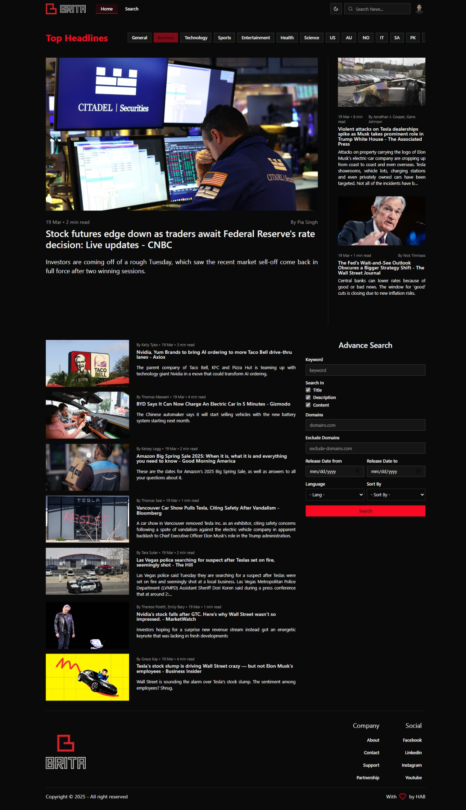

# Brita: Simple News Webpage with user Management with React, Redux, Shadcn

This project is a **simple news page and profile management system** built with **React**, **Redux**, **Shadcn**, and **LocalStorage** for user data persistence. It allows users to view, search news and update their profile, including changing their password and uploading a profile image.

## ✨ Features

### ✅ Top Headlines News And Search

- On home there is a Top Headline from variety of Media.
- Search with title or with more advance like date and domain.

### ✅ User Authentication Handling

- Retrieves user data from **LocalStorage** or **SessionStorage**.
- Checks if a user is logged in and loads their profile accordingly.

### ✅ Profile Display & Editing

- Displays **name, email, and profile image**.
- Users can **upload a new profile picture**.
- Users can **change their password** (optional).

### ✅ State Management with Redux

- Stores user data in **Redux** for global state consistency.
- Updates the Redux state when the user profile is modified.

### ✅ LocalStorage for Persistent Data

- **User information is stored and retrieved from LocalStorage**, ensuring data persistence even after a page refresh.

### ✅ Dark mode

## 🛠️ Technologies Used

- React
- Redux Toolkit
- React Hook Form
- React Router
- SWR
- LocalStorage & SessionStorage
- TypeScript
- Tailwind CSS

## 🚀 How to Run the Project

1. Clone the repository:

   ```bash
   git clone https://github.com/HadiatAbdulBashit/brita.git
   cd brita
   ```

2. Install dependencies:

   ```bash
   npm install

   # or

   bun install
   ```

3. Add .env file and fill with:

   ```env
   VITE_API_BASE_URL=https://newsapi.org/v2
   VITE_API_KEY=<your-api-key>
   ```

4. Start the development server:

   ```bash
   npm run dev

   # or

   bun run dev
   ```

5. Open your browser and navigate to `http://localhost:5173`.

## 📸 Screenshots



Developed with ❤️ by HAB
